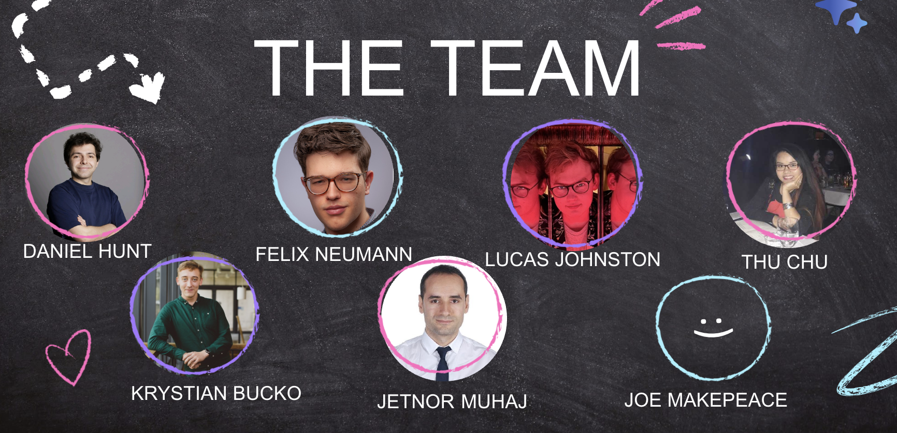

### To set up:
- Set up the .env file with API keys and login credentials 
- Install requirements:
    - `python3 -m pip install -r requirements.txt`
- Install ffmpeg on your machine. For example on mac:
    - `brew install ffmpeg`

### To run the script:
(our live demo used the `demo` branch rather than `main`)

`python3 main.py`

## To run the api:
`uvicorn api:app --reload`
